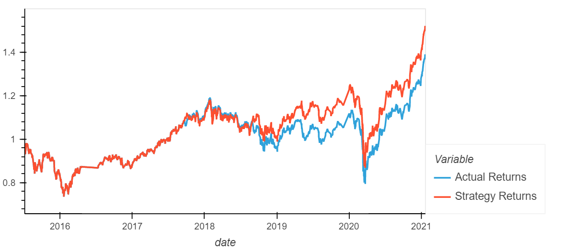
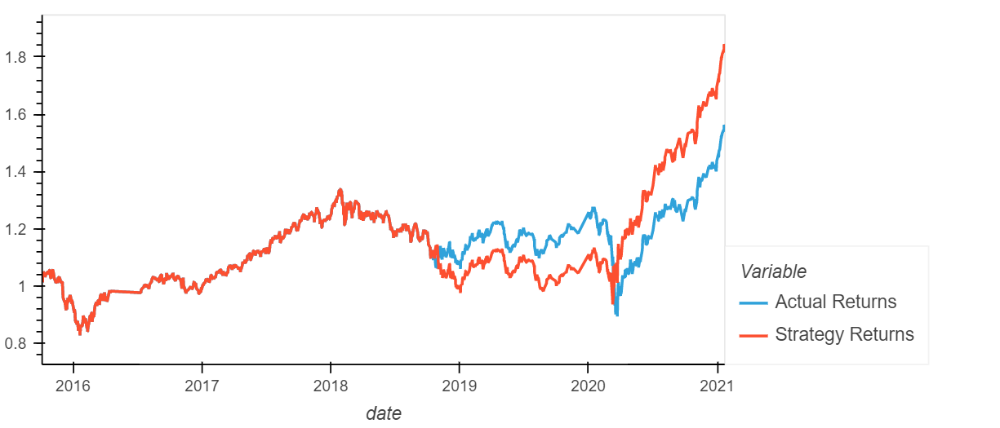
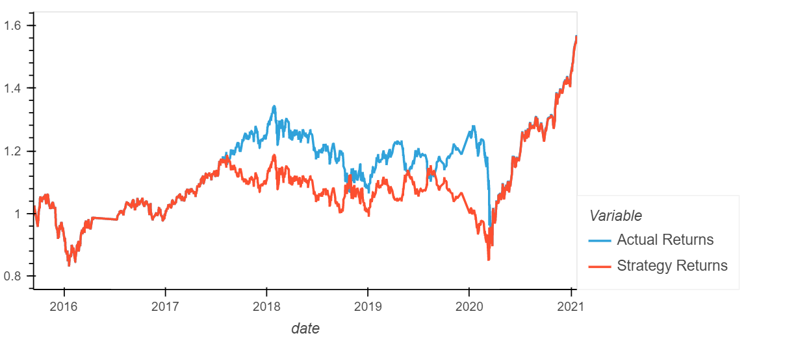
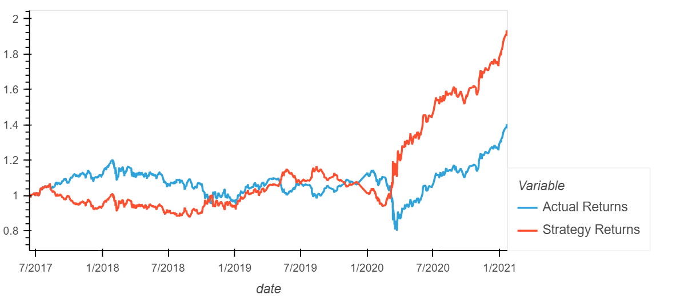
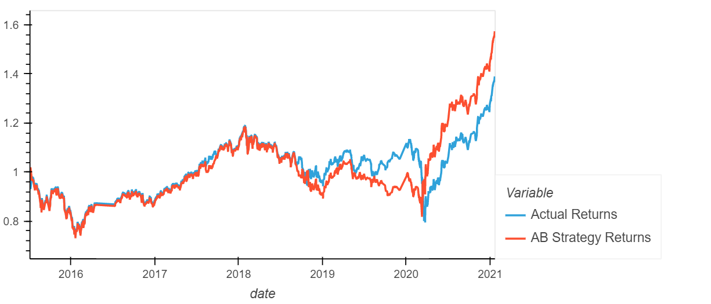

## Machine Learning Trading Bot - Report and Review

## Analysis Actual versus Returns

### Short 4, Long 100, 3 months

Training Data Used:

```python
short_window = 4
long_window = 100
DateOffset = 3 months
```

The overall accuracy score of this SVC model with these parameters was 0.55.

SVC returned a better performance in comparison with Actuals (SVC (1.52) vs Actual (1.386))



---

## Analysis of Actual versus Modified Bot Returns

### Step 1: Short 4, Long 100, DateOffset 6 months

```python
short_window = 4
long_window = 100
DateOffset = 6 months
```

Accuracy was at 0.56, and the cumulative performance was at 1.845% on the strategy.



It appears doubling the training window by 3 months has increased the overall performance by 0.325%, which is a decent increase. 

### Step 2: Short 25, Long 200, DateOffset 3 Months

```python
short_window = 25
long_window = 200
DateOffset = 3 months
```

Accuracy was at 0.49, and the cumulative performance was at 1.563% on the strategy.



The performance and information between the actual and trained model appeart to almost be in line with one another. Performance appears to have gotten worse with the change in the duration windows. 

### Step 3: Short 25, Long 200, DateOffset 24 Months

```python
short_window = 25
long_window = 200
DateOffset = 24 months
```

Accuracy was at 0.54, and the cumulative performance was at 1.933% on the strategy.



The longer the window the more apparent it is that the data will give more opportunities to learn and develop, thus improving overall performance. 

---

## Analysis of Actuals versus AdaBoost 

Going back to the original dataset:

```python
short_window = 4
long_window = 100
DateOffset = 3 months
```

With Adaboost, the accuracy appears to be in line with the previous model at 0.55, with a performance of 1.571. 



Adaboost seems to be doing better in the short term at 1.57 versus the previous model at 1.52.

---

## Conclusions

Adaboost classified seems to be a better fit for the long to short algorithm looking at this challenge.


